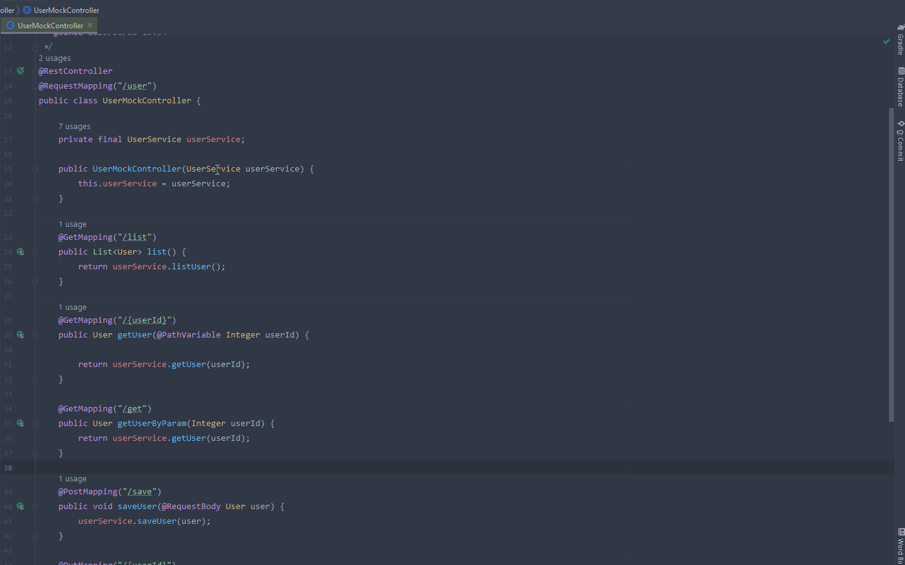

# HTTP-Test

该项目用于帮助Java开发人员快速测试SpringMvc接口

# 快速开始

1. 安装IDEA插件
- 从插件仓库[http-test](https://plugins.jetbrains.com/plugin/15375-http-test-support)
- 直接下载[jar包](https://github.com/cweijan/http-test-idea/releases/download/1.2.1/Http-Test-IDEA.jar)安装

2. 增加maven依赖
```xml
<dependency>
    <groupId>io.github.cweijan</groupId>
    <artifactId>http-test</artifactId>
    <version>0.0.9</version>
</dependency>
```

3. 在SpringMvc的Controller类上面按下alt+enter, 在弹窗的菜单中点击**创建Http测试用例**

演示: 



# 常用API
- Generator: 用于生成mock数据
- Asserter: 用于对数据进行断言验证
- Mocker: 可修改默认设置

# 实现原理
1. 扫描controller并使用ByteBuddy动态创建feign接口
2. 根据接口创建feign
3. 构建controller代理, 执行方法时实际调用feign
